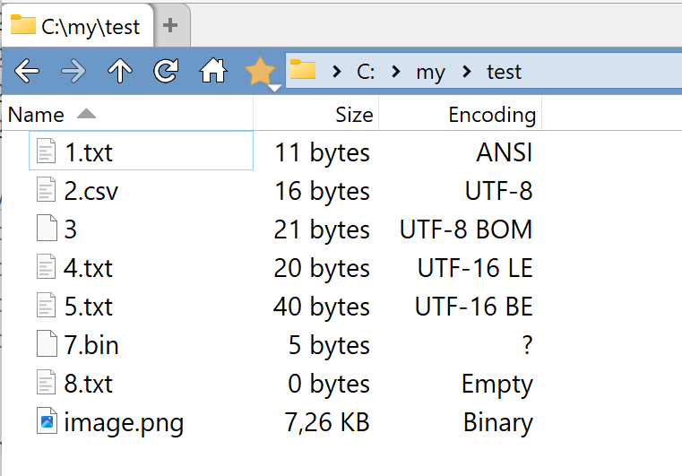

# DirectoryOpus-TextFileEncoding-plugin
The plugin to show the text encoding column. 

# Features
* Determines the following file encodings:
  * ANSI
  * UTF-8
  * UTF-8 with BOM
  * UTF-16 LE
  * UTF-16 BE
  * UTF-32 LE
  * UTF-32 BE
  * Binary
* You can specify the extension for which the plugin will be used. By default all files are processed.

# How it works
The plugin read up to 1024 bytes from each file and uses various heuristics to determine the encoding.

# How to use
* Download the `js` file from the [latest release](https://github.com/PolarGoose/DirectoryOpus-TextFileEncoding-plugin/releases)
* Copy the `js` file to the `%AppData%\GPSoftware\Directory Opus\Script AddIns` folder
* The extra columns will become available in the `Settings`->`File Display Columns`->`Appearance`->`Columns:`.
